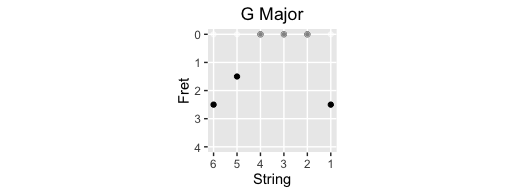

# ggguitar

[](http://cran.rstudio.com/web/packages/ggguitar/index.html)

## Description
Create Guitar Tablature and related documentation.  Powered by ggplot2 and the Tidyverse.

## Example Usage
```
> library(ggguitar)
> chord_GM <- c(3, 2, 0, 0, 0, 3)
> tablature('G Major', chord_GM)
```



```
> chord_for_frets(chord_GM)
[1] "g" "b" "d" "g" "b" "g"
```
